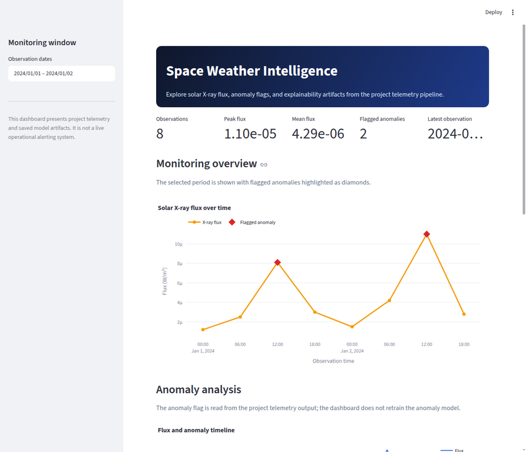
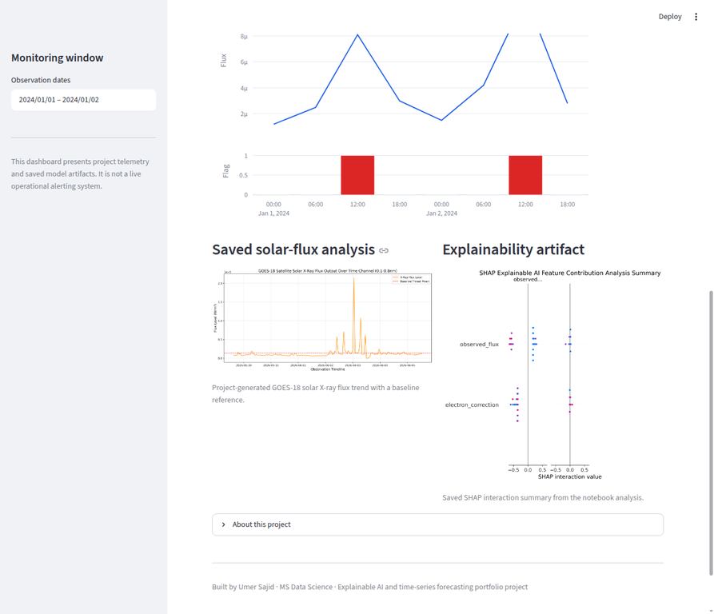
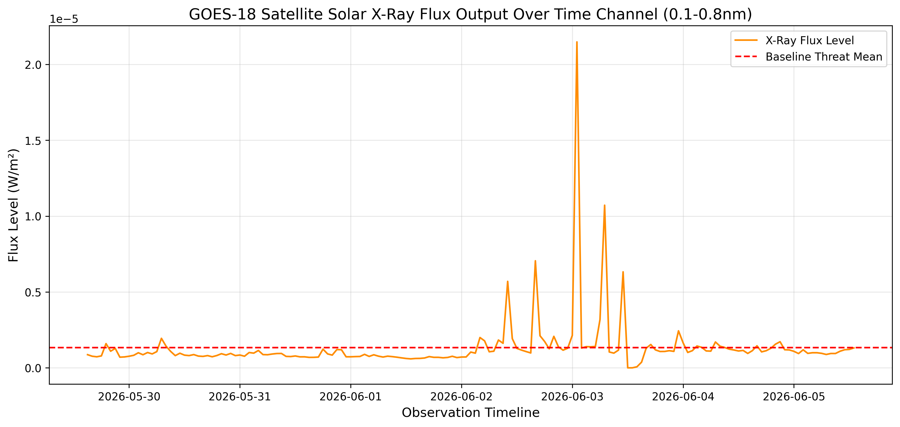
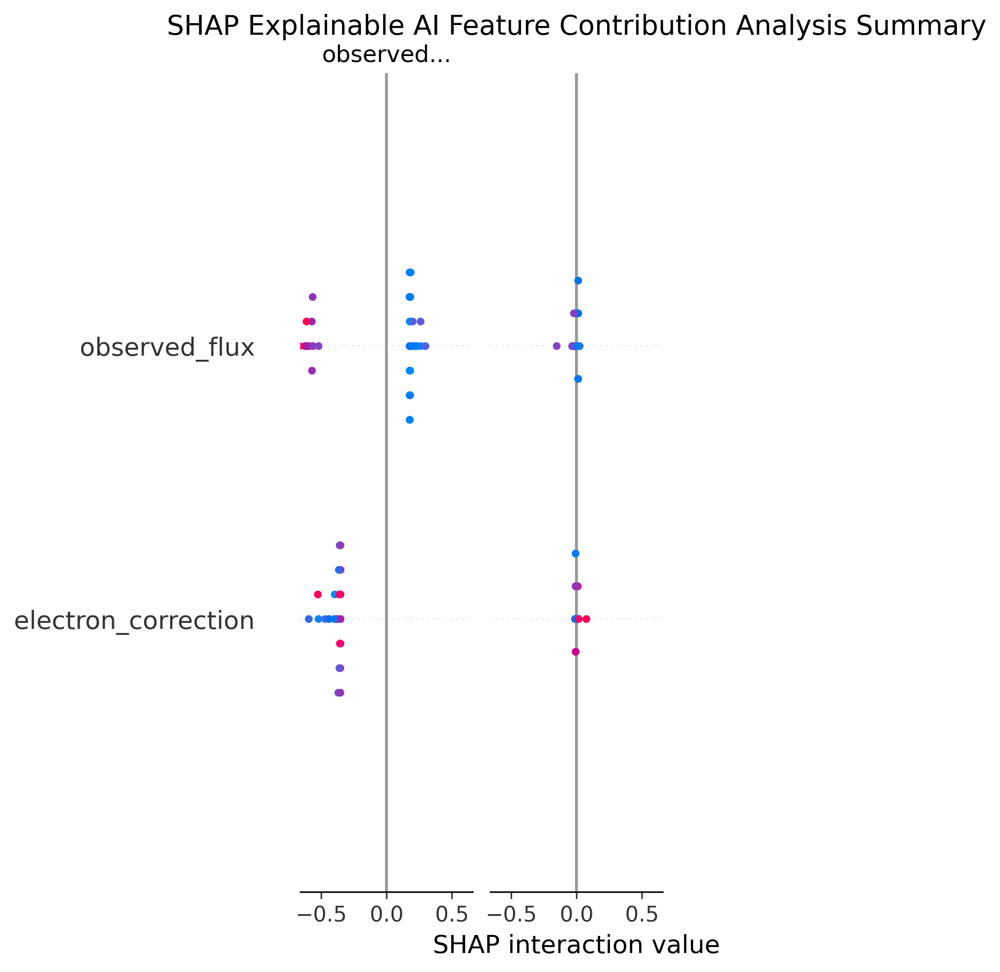

# Space Weather Intelligence: Forecasting, Anomaly Detection, and Explainable AI

[](https://github.com/UmerSajid842/Space_Weather_Project/actions/workflows/ci.yml)
[](LICENSE)

An end-to-end machine-learning portfolio project that studies solar and space-weather telemetry through time-series forecasting, anomaly detection, risk modeling, and SHAP-based explainability. The repository combines an exploratory research notebook with a polished Streamlit dashboard that presents saved telemetry outputs and model artifacts.

> **Start here:** This is an explainable space-weather analytics prototype, not a live operational warning or safety-critical forecasting service. It makes the research-to-dashboard workflow inspectable through its telemetry contract, saved artifacts, focused tests, and explicit limitations.

| Recruiter evidence | Where to review it |
|---|---|
| Portfolio interaction | [Open the related Space Weather demonstration](https://umershowcase-9jm3bans.manus.space/demos/space-weather) |
| Analytical flow | [Review the architecture](#architecture) and [dashboard preview](#dashboard-preview) |
| Run locally | `pip install -r requirements.txt` then `streamlit run dashboard.py` |
| Test it | `python -m compileall -q dashboard.py dashboard_utils.py tests` then `python -m pytest -q` |
| Data provenance | [Read the source and data-handling notes](#data-provenance) |
| Scope boundary | [Review limitations and next steps](#limitations-and-next-steps) |

The project is positioned as an **ML Engineer / Data Scientist portfolio case study**: it demonstrates data preparation, model experimentation, evaluation artifacts, explainability, and product-oriented visualization in one workflow.

> **Scope note:** The dashboard is an analytical demonstration built from project telemetry outputs. It is not a live operational alerting system and must not be used for safety-critical decisions.

## Project highlights

| Area | What is included |
| --- | --- |
| Time-series modeling | ARIMA and LSTM forecasting experiments in the notebook, with saved forecast outputs and evaluation work |
| Anomaly detection | Isolation Forest and autoencoder experiments, with anomaly flags surfaced in the dashboard telemetry |
| Risk modeling | Random Forest classification experiments using engineered telemetry features |
| Explainable AI | SHAP interaction analysis saved as a project artifact |
| Dashboard | Streamlit interface with date filtering, KPI cards, flux trend, anomaly timeline, and artifact gallery |
| Engineering quality | Validated data-loading helpers, safe empty-period behavior, deterministic Plotly figures, and focused tests |
| Reproducibility | Explicit notebook workflow, local telemetry contract, dependency manifest, and documented external data references |

## Dashboard preview

The upgraded dashboard is organized around three questions: **What happened in the selected observation window? Which observations were flagged as anomalies? What saved explainability evidence supports the modeling work?**



*Dashboard overview showing the professional header, monitoring window, KPI cards, and highlighted flux anomalies.*



*Dashboard lower section showing the anomaly timeline, saved solar-flux visualization, and SHAP artifact gallery.*

## Visual analysis artifacts

The repository also includes notebook-generated visuals that can be reviewed independently of the interactive dashboard.

| Artifact | Purpose |
| --- | --- |
| `docs/solar_flux_trend.png` | Project-generated solar X-ray flux trend with a baseline reference |
| `docs/shap_explainability_analysis.png` | Saved SHAP interaction summary for the notebook’s explainability analysis |
| `forecast_results.csv` | Forecast output artifact committed with the project |
| `BI_Dashboard_Telemetry_Data.csv` | Small telemetry output consumed by the Streamlit dashboard |



*Saved project visualization of GOES-18 solar X-ray flux over an observation window.*



*Saved SHAP interaction summary from the exploratory notebook. The displayed features should be interpreted in the context of the notebook’s preprocessing and model setup.*

## Architecture

```text
Space_Weather_Project (3).ipynb
        |
        | exploratory preprocessing, forecasting, anomaly detection, XAI
        v
CSV outputs + PNG artifacts
        |
        v
BI_Dashboard_Telemetry_Data.csv
        |
        v
 dashboard_utils.py  --->  dashboard.py  --->  Streamlit interface
    validation              KPI cards, flux chart,
    date filtering           anomaly timeline, artifact gallery
```

The notebook is the research and modeling workspace. The dashboard is intentionally narrower: it presents the telemetry contract and saved artifacts rather than retraining heavy models on every page load.

## Repository structure

```text
.
├── Space_Weather_Project (3).ipynb       # Exploratory modeling notebook
├── dashboard.py                          # Streamlit application
├── dashboard_utils.py                    # Data validation, filters, KPIs, Plotly figures
├── tests/test_dashboard_utils.py         # Lightweight dashboard helper tests
├── BI_Dashboard_Telemetry_Data.csv       # Dashboard telemetry output
├── forecast_results.csv                  # Forecast artifact
├── docs/
│   ├── dashboard_overview.webp           # Dashboard screenshot
│   ├── dashboard_artifacts.webp          # Dashboard artifact-gallery screenshot
│   ├── solar_flux_trend.png              # Normalized visual artifact copy
│   └── shap_explainability_analysis.png  # Normalized visual artifact copy
├── dashboard.py
├── requirements.txt
└── README.md
```

## Local setup

The project supports Python 3.10 or newer. The committed telemetry CSV is small enough for a quick dashboard demonstration; the full notebook workflow may require substantially more memory and compute, especially for TensorFlow, SHAP, and sequence-model experiments.

```bash
git clone https://github.com/UmerSajid842/Space_Weather_Project.git
cd Space_Weather_Project
python -m venv .venv
```

Activate the virtual environment:

```bash
# Windows PowerShell
.venv\Scripts\Activate.ps1

# macOS/Linux
source .venv/bin/activate
```

Install the dependencies and launch the dashboard:

```bash
pip install -r requirements.txt
streamlit run dashboard.py
```

The dashboard reads `BI_Dashboard_Telemetry_Data.csv` from the repository directory. The expected columns are:

| Column | Meaning in the dashboard |
| --- | --- |
| `time_tag` | Observation timestamp, parsed to a timezone-naive pandas datetime |
| `flux` | Numeric solar/telemetry flux value plotted over time |
| `Is_Anomaly` | Integer anomaly flag; values of `1` are highlighted in the dashboard |

## Notebook workflow

Open `Space_Weather_Project (3).ipynb` in Jupyter or Google Colab and execute the cells in order. The notebook contains the broader modeling work, including cleaning, feature engineering, exploratory analysis, forecasting experiments, anomaly detection, Random Forest risk modeling, SHAP analysis, and export of dashboard-ready files.

The notebook includes exploratory training and evaluation code. Before making a scientific claim, review the data split, target definition, class balance, feature leakage risk, and evaluation metrics in the relevant notebook cells. The README intentionally does not claim that one forecasting model universally outperforms another.

## Data provenance

The project README and notebook refer to NASA and NOAA-related space-weather observations. For authoritative context and reproducible source review, consult the following public references:

- [NOAA Space Weather Prediction Center: GOES X-ray Flux](https://www.spaceweather.gov/products/goes-x-ray-flux) — background on using GOES X-ray plots to track solar activity and flares.
- [NOAA Physical Sciences Laboratory: Solar Flux at 10.7 cm](https://psl.noaa.gov/data/timeseries/month/SOLAR/) — long-running solar radio-flux time-series reference.
- [NASA: Solar Cycle Progression and Forecast](https://www.nasa.gov/solar-cycle-progression-and-forecast/) — context for solar-cycle and F10.7 forecasting products.

The repository’s committed CSV files are project outputs and should not automatically be treated as canonical copies of an external agency dataset. When reproducing the notebook, record the original source URL, retrieval date, transformations, and any filtering decisions.

## Testing and validation

Run the lightweight dashboard checks from the repository root:

```bash
python -m compileall -q dashboard.py dashboard_utils.py tests
pytest -q
```

The tests cover required-column validation, invalid-row handling, inclusive date filtering, KPI computation, anomaly counts, and safe empty-period behavior. They do not retrain ARIMA, LSTM, SHAP, or TensorFlow models.

## Limitations and next steps

The dashboard currently presents saved telemetry and model artifacts rather than a live NASA/NOAA API stream. The notebook’s heavy experiments are not executed automatically by the dashboard. Further professionalization could add a versioned data-preparation script, model registry, formal train/validation/test splits, forecast backtesting, calibration analysis, uncertainty intervals, structured experiment tracking, and a live-data connector with explicit rate-limit and operational safeguards.

The project is best presented as an explainable space-weather analytics prototype and portfolio case study—not as a validated forecasting service or operational warning product.

## Author

**Umer Sajid** · MS Data Science

Focus: Machine Learning, Explainable AI, Time-Series Forecasting, and Data Applications

## References

[1]: https://www.spaceweather.gov/products/goes-x-ray-flux "NOAA Space Weather Prediction Center: GOES X-ray Flux"

[2]: https://psl.noaa.gov/data/timeseries/month/SOLAR/ "NOAA Physical Sciences Laboratory: Solar Flux (10.7cm)"

[3]: https://www.nasa.gov/solar-cycle-progression-and-forecast/ "NASA: Solar Cycle Progression and Forecast"
